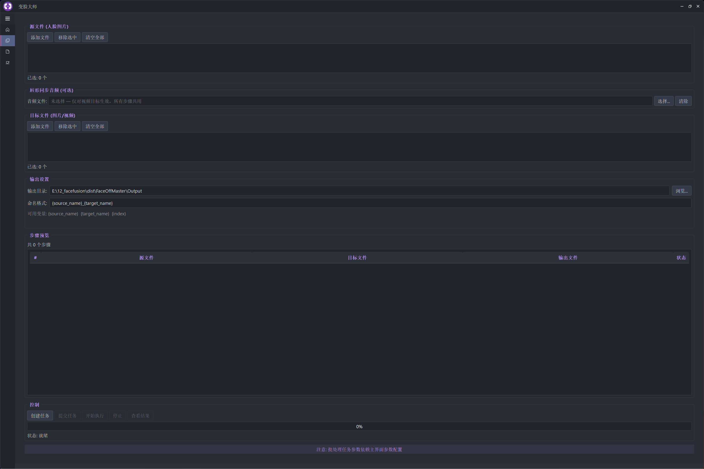
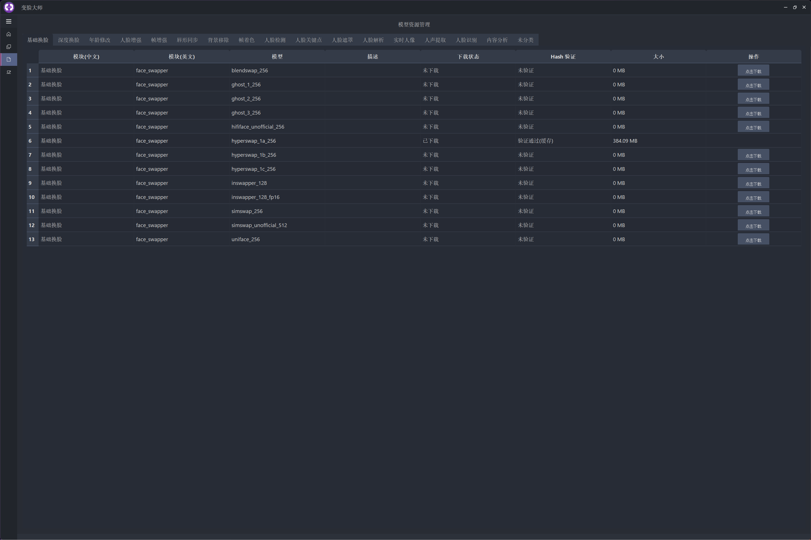

## 视频介绍

<iframe src="//player.bilibili.com/player.html?isOutside=true&aid=116594889988161&bvid=BV1n6Lw6mEz5&cid=38423760344&p=1" scrolling="no" border="0" frameborder="no" framespacing="0" allowfullscreen="true"></iframe>

## 产品概述

**变脸大师（FaceOff Master）** 是一款基于开源项目 [FaceFusion 3.6.0](https://github.com/facefusion/facefusion) 深度开发的 Windows 桌面级 AI 换脸软件。它将 FaceFusion 强大的 AI 换脸引擎与精心设计的图形用户界面完美结合，让用户无需任何编程知识，即可轻松完成高质量的图片和视频换脸创作。

> **一句话总结**：装上就能用，打开就能换 —— 把复杂的 AI 换脸技术变成人人都能上手的桌面工具。

## 核心功能

### 11 大 AI 处理器

变脸大师内置了 FaceFusion 引擎的全部 11 种 AI 处理器，覆盖从基础换脸到高级人脸编辑的完整工作流：

| 处理器 | 功能说明 | 亮点 |
|---|---|---|
| **基础换脸** | 将源人脸替换到目标图片/视频中 | 13 种模型可选，支持像素增强 |
| **深度换脸** | 使用名人专属 DFM 模型进行高精度换脸 | 100+ 预训练模型，效果更逼真 |
| **年龄修改** | 调整人物面部年龄（年轻化/老化） | 滑块控制，-100 到 +100 无级调节 |
| **人脸增强** | 修复和增强模糊或低质量人脸 | 集成 GFPGAN 等先进模型 |
| **画质增强** | 提升整体画面分辨率和清晰度 | Real-ESRGAN 模型，支持视频超分 |
| **唇形同步** | 将音频与视频中人物口型同步 | Wav2Lip 技术，配音利器 |
| **背景移除** | 智能去除人物背景 | 支持 RGBA 通道输出 |
| **表情还原** | 还原或调整人物面部表情 | LivePortrait 驱动，分区精细控制 |
| **人脸编辑** | 微调五官、头部姿态等 14 项参数 | 眉毛、眼神、嘴唇、笑容独立调节 |
| **帧着色** | 为黑白影像智能上色 | DeOldify 模型，老照片修复神器 |
| **人脸调试** | 可视化人脸检测框、关键点、遮罩 | 便于检查和调试处理效果 |

### 精细化面部参数

变脸大师提供了精细的人脸处理控制，让你对换脸效果拥有完全的掌控力：

- **人脸选择**：按顺序、性别、种族、年龄范围自动筛选目标人脸
- **人脸遮罩**：支持区域遮罩、遮挡遮罩、面部区域遮罩等多种模式
- **人脸检测**：多模型可选（RetinaFace、SCRFD、YOLO-Face、YuNet），支持多角度检测
- **人脸编辑微调**：14 项独立参数，包括眉毛方向、眼神注视、眼睛开合、嘴唇张合、笑容强度、头部姿态（俯仰/偏航/翻滚）

### 批量任务处理

支持**笛卡尔积批量处理**——选择多个源人脸和多个目标文件，一键生成所有组合结果。内置任务队列、进度监控和耗时统计，大幅提升工作效率。

### 模型资源管理

内置**模型下载中心**，支持从 GitHub 和 HuggingFace 双源下载，支持断点续传和并发下载，哈希校验确保模型完整性。所有模型一键下载、自动管理，无需手动配置。

## 系统要求

| 项目 | 最低配置 | 推荐配置 |
|---|---|---|
| **操作系统** | Windows 10（64 位） | Windows 10/11（64 位） |
| **内存** | 8 GB | 16 GB 及以上 |
| **显卡**     | CPU (运行较慢)          | 独立显卡、NVIDIA RTX 3060 及以上 |
| **显存** | 4 GB | 8 GB 及以上 |
| **存储空间** | 5 GB（软件 + 基础模型） | 20 GB 及以上（含完整模型库） |
| **其他依赖** | — | curl、ffmpeg（安装包已内置） |

> **注意**：变脸大师依赖 NVIDIA GPU 的 CUDA 加速能力

## 使用说明

变脸大师的操作流程简洁直观，四步即可完成换脸：

### 第一步：选择源人脸

上传包含目标人脸的图片（支持 JPG、PNG、BMP、WebP、GIF 格式）。拖拽或点击上传均可，支持多张源人脸切换。

### 第二步：选择目标文件

上传需要替换人脸的目标图片或视频（视频支持 MP4、AVI、MOV、MKV、WMV、FLV、WebM）。内置视频播放器，方便预览和定位处理帧。

### 第三步：配置处理参数

在右侧面板中选择处理器类型、调整人脸参数、设置输出格式和质量。新手可直接使用默认配置，效果同样出色。

### 第四步：开始处理

点击「开始合成」按钮，实时查看处理进度和预览效果。处理完成后可直接在软件内播放结果视频，满意后保存到本地。

## 软件截图

### 主界面

### 深度换脸

### 人脸微调

## 下载

变脸大师（FaceOff Master）当前版本：**v1.0.0**

> 下载链接：[点击下载变脸大师 v1.0.0](#)  *(链接将在正式发布时更新)*

提供 **7 天免费试用**，试用期内享受全部功能，满意后再购买授权。支持**年度订阅**和**终身买断**两种授权方式。

## 版本更新

### v1.0.0（2026-06-01）— 正式首发

- 集成 FaceFusion 3.6.0 核心引擎，提供 11 大 AI 处理器
- 精美的暗色主题桌面界面，支持自定义窗口大小和布局
- 完整的模型资源管理中心，一键下载 58 类预训练模型
- 笛卡尔积批量任务处理，支持多源 × 多目标自动编排
- 14 项人脸微调参数，表情、眼神、头部姿态精细控制
- 多种执行后端自动检测和适配（CUDA、TensorRT 优先）
- 视频预览播放、音频同步唇形、画质增强等高级功能
- 商业授权和试用授权双模式，一机一码安全保障

---

> **变脸大师 FaceOff Master** —— 让 AI 换脸触手可及。
>
> 如有问题或建议，欢迎联系我们。
